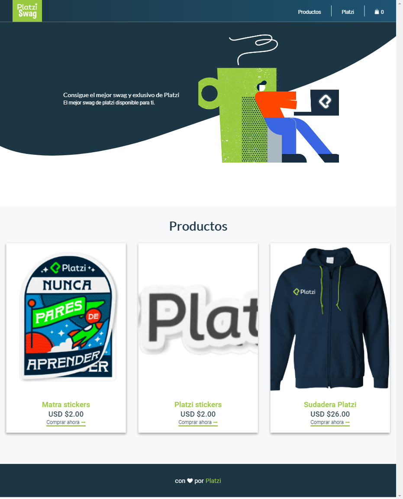

# Platzi Swag

Platzi Swag es un proyecto contruido con gatsby que trae los mejor de 2 mundos. React y Nodejs lo que hace nodejs es configurar el server-side-render para optimizar la velocidad en tiempo de carga de nuestra aplicación ademas que utiliza plugins para construir aplicaciones robustas que permite consumir datos de cualquier otra fuente externa.

- Gatsby Plugins de Fuente de Datos
- GraphQL
- Reactjs
- Server Side Render

[Ver la app en Producción](https://pswag.now.sh/)

## Scripts

- `npm install` or `yarn install` para instalar las dependencias
- `npm run develop` or `yarn develop` para entorno de desarrollo
- `npm run build` or `yarn build` para producción

## Licencia

MIT
